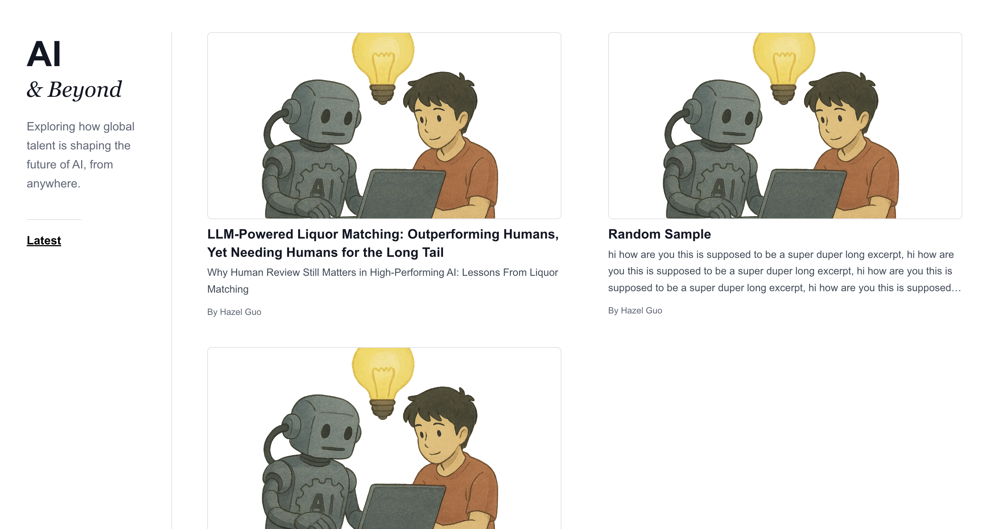
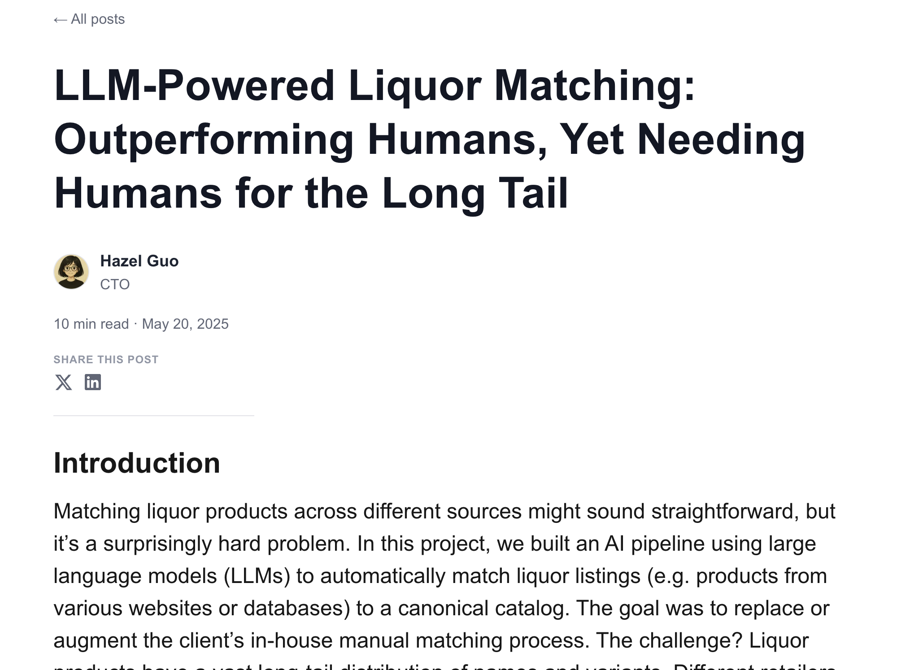

# Blog Template

A clean, modern blog template built with Next.js and Tailwind CSS. Perfect for creating a professional blog with markdown support.

## Preview

### Home Page


### Blog Post


## Features

- 📝 Markdown support for blog posts
- 🎨 Clean, responsive design
- ⚡ Built with Next.js 15 and React 19
- 🎯 TypeScript support
- 📱 Mobile-friendly layout

## Getting Started

1. Clone this repository
2. Install dependencies:
   ```bash
   npm install
   ```
3. Run the development server:
   ```bash
   npm run dev
   ```
4. Open [http://localhost:3000](http://localhost:3000) in your browser

## Adding Blog Posts

Create new markdown files in `src/content/posts/` with the following frontmatter:

```markdown
---
title: "Your Post Title"
date: "2025-01-01"
author: "Your Name"
authorTitle: "Your Title"
readTime: 5
excerpt: "Brief description of your post"
image: "/covers/your-image.png"
---

Your blog content here...
```

## Customization

- Update author information in `src/components/Sidebar.tsx`
- Add your avatar to `public/avatars/`
- Add cover images to `public/covers/`
- Modify styling in `src/app/globals.css`

## Deployment

Deploy easily on [Vercel](https://vercel.com) or any other Next.js hosting platform.
